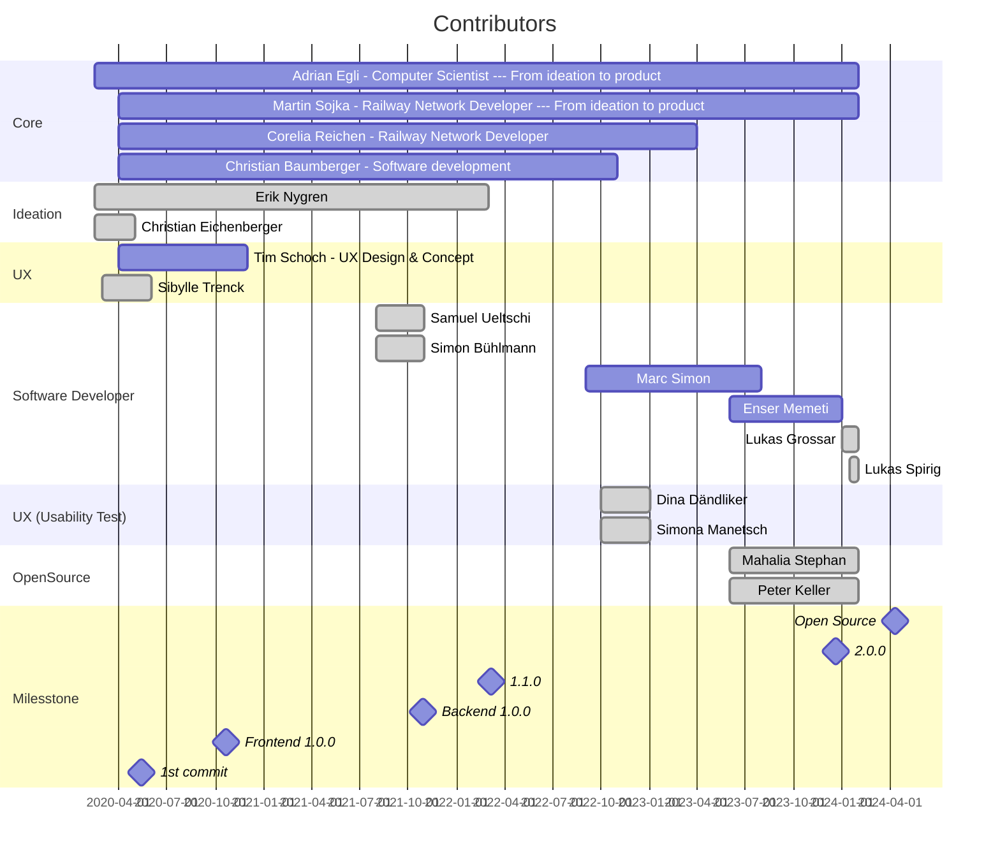

# Contributors

Many thanks to all contributors for their engagement and contribution, without which this project
would not have been possible. Thank you for your current and future contribution!

It all started with the idea of creating an interactive planning tool with minimal complexity and
maximum usability. To achieve this ambitious goal, a comprehensive UX design concept was developed
and consistently implemented. However, even the best concept can only be successful when an
interdisciplinary team is willing to contribute their entire knowledge to the conception,
implementation, and continuous improvement and is willing to challenge each other. Therefore,
special thanks should be dedicated to the exceptional, interdisciplinary, and creative collaboration
of all participants from the very beginning - from the idea to the productive application.

### Special thanks to the contributors of the first minute

---

**[Martin Sojka](https://www.linkedin.com/in/martin-sojka-360229143)** (Railway Network Developer - From the initial idea to the product)

**[Adrian Egli](https://github.com/aiAdrian)** (Computer Scientist - From the initial idea to the product)

**[Corelia Reichen](https://www.linkedin.com/in/corelia-reichen-b4237227)** (Railway Network Developer - Conception)

**[Tim Schoch](https://timschoch.com/)** (UX architect - Conception)

**[Christian Baumberger](https://github.com/christianbaumberger)** (Software engineer - Conception)

---

### Contributors

Every contribution is valuable, such as participation in brainstorming, UX tests, feedback from the
user's perspective, or software development. The following people made a valuable contribution on
the road to productive application and/or making the code public.



and to all users for their early continuous feedback.

---

Executing this command will display the commit count and author name for each contributor, sorted by
the number of commits.

```bash
git shortlog --summary --numbered --all --no-merges
```

> Note: Lists only authors with at least one commit since code base is on github / open source.

---

And finally, special thanks goes to [Swiss Federal Railways (SBB CFF FFS)](https://www.sbb.ch) - it
was only thanks to their commitment that this project could be realized. SBB CFF FFS is continually
simplifying its planning processes and driving digitalization forward. The decision by SBB CFF FFS
to publish the project as open source software enables the entire planning community to benefit from
the Netzgrafik-Editor as (business) open-source software.
