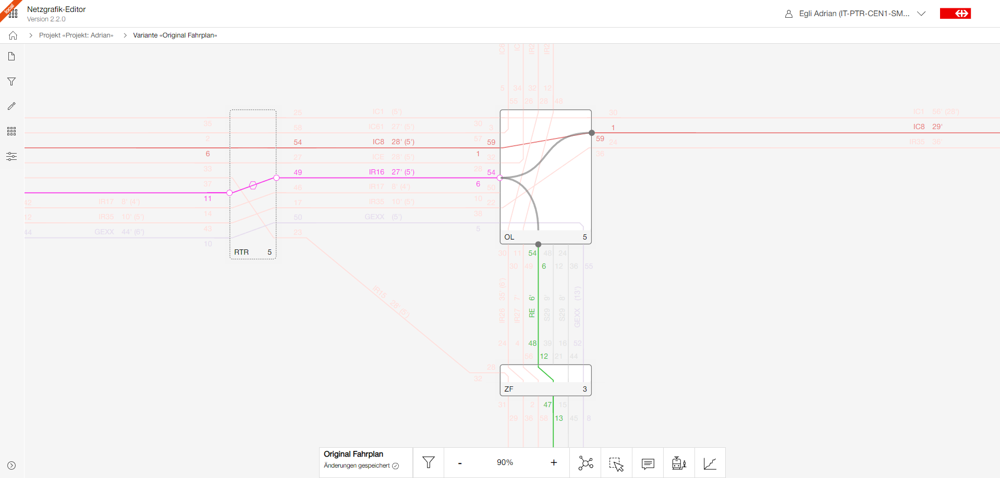

# Netzgrafik-Editor

<details>
<summary>
Netzgrafik-Editor – designed to make better decisions.
</summary>
 
<br>
The product vision is to accelerate the planning and sizing of transport systems by creating an intuitive and powerful platform that uses smart projections and analyses. This will enable timetable variations or service options to be created, compared, and optimized very easily, with maximum support for the human planner during their creative process. The goal is to ensure that decisions can be made based on data-driven insights, to guarantee a smooth mobility for the future that is fast, efficient, and goal-oriented.
<br><br>

> **Flexible level of detail** - start with a rough sketch, continuously add more detail.
>
> Applicable across **different industries** - bus, train, plane.
>
> **Scales with your use-case** - from hobbyist timetabling to professional planning.
>
> **Human-centric** - timetable planning is a very complex and creative process. Netzgrafik-Editor
> supports the user by digitalizing the previously paper-driven process, while providing instant
> analysis capabilities.
>
> **Excellent and intuitive UX** - using Netzgrafik-Editor should be as easy and natural as drawing
> on a whiteboard. No training required. Analysis happens in real time.

</details>

## Introduction

The Netzgrafik-Editor is a powerful software that enables the creation, modification, and analysis
of regular-interval timetable.

<details>
<summary>
Regular-interval timetable
</summary>

<br>

> Regular-interval timetables were first developed in Germany at the beginning of the 20th century
> to coordinate urban traffic in large cities such as Berlin.
>
> The regular schedules aim to increase the attractiveness of public transport because they’re
> easier to memorise for passengers and because the patterns make the planning of resources easier.
>
> Such constant schedules may also improve services during off-peak hours.
>
> The Dutch were in 1970 credited with the first junction system, which then was the basis for the
> Swiss regular-interval timetable in 1982.
>
> [History - The regular-interval timetable](https://houseofswitzerland.org/swissstories/history/nation-railway-enthusiasts-history-swiss-railways)
>
> [clock-faced schedules](https://en.wikipedia.org/wiki/Clock-face_scheduling)
>
> [Source](https://www.swissinfo.ch/eng/to-the-second_the-swiss-timetable-is-due-to-meticulous-planning/34102496)

</details>



It offers various functions to enhance the efficiency and optimization of the logistics network.
Some of the key features include:

- **Interactive drawing tool to edit the Netzgrafik:** A user-friendly and interactive graphical
  editor for creating and editing regular-interval timetables. It provides a
  visual interface to easily visualize and adjust the logistics network.

- **Graphic timetable (Streckengrafik):**
  All lines (trainruns) defined in the Netzgrafik can be transferred into a graphical timetable
  representation (Streckengrafik).

- **Perlenkette trainrun editing:** Planners can manually draw and edit the trainruns as a chain,
  allowing them
  to define crucial aspects of the logistics network and tailor it
  to specific requirements and constraints.

- **Logistical Information Extraction:** The software extracts important logistical information from
  the regular-interval timetable,
  such as departure and destination stations, departure and arrival times, and train frequency.

- **Logistics Network Analysis:** Planners can analyze the logistics network based on the timetable
  representation.
  The software provides insights into connection coordination, transfer times, and logistical
  connections, facilitating optimization and efficiency improvement.

- **Infrastructure Requirement Estimation:** Infrastructure requirements can be estimated based on
  the entered timetable representation,
  aiding in infrastructure planning and decision-making.

## Origin and Open Source Collaboration

The Netzgrafik-Editor, initially developed as an internal innovation project at the
[Swiss Federal Railways (SBB CFF FFS)](https://www.sbb.ch).
The project started with a clickable prototype. From this early stage of the project,
there are still ideas and concepts that have not yet been realised, so it is always worth taking a
look [at this document](https://xd.adobe.com/view/e4664ae0-be8f-40e4-6a55-88aec9eafd8d-9257/).
The entire project has now reached a mature stage and evolved into a powerful tool with applications
beyond railways. It can now be utilized in any domain that requires regular-interval timetables as a
planning basis.

The versatility of the editor makes it suitable for various logistics planning scenarios, enabling
efficient timetable creation and analysis. The software's key features can be leveraged in a broader
context, such as:

- **Public Transportation Systems:** Other public transport networks can utilize the editor's
  flexibility and features to effectively visualize and plan their transportation systems,
  leading to improved efficiency and better services.

- **Educations:** The editor's capabilities can be utilized in educational institutions to demonstrate
  how to create integrated timetables and what properties need to be considered during the planning
  process in order to enable efficient scheduling

<details>
<summary>more ...
</summary>

By extending the scope of its application beyond railways, the Netzgrafik-Editor has the potential
to become a valuable tool in numerous sectors,
providing comprehensive control, optimization, and synchronization of time-based planning.

Due to these diverse applications of the Netzgrafik-Editor and its increasing value in various
areas,
the decision was made to release it as open source software.
This is intended to promote broad use and collaboration at the planning level,
as well as actively support the further development of new ideas from different industries so that
the editor constantly improves and,
in the best case, establishes itself as a standard tool across different public transportation
industries.

</details>

Community [participation and collaboration](CONTRIBUTING.md)
in the development process is extremely important and desired to ensure that the editor gains
diversity
and functionality and meets the needs and challenges of different application domains.
The openness of the project encourages innovation, expertise from different sectors and continuous
improvements to optimize the
planning processes.

## Roadmap

Get an insight into the plan and future [ROADMAP.md](ROADMAP.md).

## User Manual

The user manual can be found here [USERMANUAL.md](documentation/USERMANUAL.md)

## Online Demo

[Extern: nge.flatland.cloud](https://nge.flatland.cloud) - powered by [Flatland Association](https://www.flatland-association.org/)

( [Sample Netzgrafik](https://github.com/SchweizerischeBundesbahnen/netzgrafik-editor-frontend/blob/main/src/app/sample-netzgrafik/Demo_Netzgrafik_Fernverkehr_2024.json) - [How to Import JSON](https://github.com/SchweizerischeBundesbahnen/netzgrafik-editor-frontend/blob/main/documentation/DATA_MODEL_JSON.md) )

## Setup Local Demo Environment with Docker Compose

Use [extern: netzgrafik-editor-docker-compose](https://github.com/flatland-association/netzgrafik-editor-docker-compose) for a one-line setup based
on [Docker Compose](https://docs.docker.com/compose/) - powered by [Flatland Association](https://www.flatland-association.org/).

## Getting-Started

### Development setup

For a working local development setup, you also need to start
the [backend](https://github.com/SchweizerischeBundesbahnen/netzgrafik-editor-backend)!

```shell
# clone project from https://github.com/SchweizerischeBundesbahnen/netzgrafik-editor-frontend
git clone https://github.com/SchweizerischeBundesbahnen/netzgrafik-editor-frontend.git

# switch into folder
cd netzgrafik-editor-frontend

```

```shell
# install all npm dependencies
npm install

# start ng server (connects to local backend, make sure it is set up and running)
npm run start
```

#### The dockerized variant

```shell
# install
apt install docker
apt install docker-compose-plugin

# build
docker compose build

# run
docker compose up
```

#### Access to Netzgrafik-Editor frontend

> open address in browser http://localhost:4200/
>
> Login with username **user** and password **user**

#### For Nix Package Manager users

Nix users can use the `flake.nix` file to setup a development environment.

To use the flake, the Nix experimental features `nix-command` and `flakes` are required.

See [official Nix documentation](https://nixos.wiki/wiki/Flakes) for more information.

Combined with the `direnv` tool, the following commands can be used to setup the development environment each time the project folder is entered:

```shell
# allow direnv to use the flake
echo "use flake" >> .envrc && direnv allow
```

See [official direnv documentation](https://direnv.net/) for more information.

### Linting

```sh
# to fix the eventual lint issues
npm run lint

# to check that the code is correctly linted
npm run lint:fix
```

### Formatting

Since we use Prettier as formatter, you can freely setup you favorite IDE to support you in the way. For example, if you use VSCode, follow these steps:

- install the [Prettier extension](https://marketplace.visualstudio.com/items?itemName=esbenp.prettier-vscode)
- (optionnal: install Prettier via npm `npm install --global prettier`)
- now, if you try left-click and select "Format Document", you'll be able to format manually using Prettier

Nice to have: Format on Save

- you can enable this functionnality by opening VSCode "Settings" and activate "Editor: Format on Save" (this way, your code will be formatted each time your file is saved)
- alternatively, you can just add these lines in `settings.json` (open using `Cmd` + `shift` + `p` and search "Open User Settings (JSON)")

```json
{
  "editor.formatOnSave": true,
  "editor.defaultFormatter": "esbenp.prettier-vscode"
}
```

```sh
# to check that the code is correctly formatted
npm run format:check

# to format the code according to Prettier rules
npm run format
```

### Testing

```sh

### Testing

```

# just run the test once

npm run test

# or run the test in the browser

npm run test -- --browsers Chrome

````

## Backend API code generation

The backend API is specified using [OpenAPI](https://swagger.io/specification/) (
see `api-docs.json`).
Angular Services for the communication with the backend API are generated based on this
specification using [openapi-generator](https://github.com/openapitools/openapi-generator) and added
to the repo (see `src/app/api/generated`).

### Update the API Version

In order to update the API Version start the local backend server.
The new spec can then be downloaded at <http://localhost:8080/v3/api-docs/>.

The new API Service files can be generated using the following command:

```shell
npm run generate:api
````

## Documentation

Please consider the following information:

- [DATA MODEL](./documentation/DATA_MODEL.md)

- [CODING_STANDARDS.md](CODING_STANDARDS.md)
- [CONTRIBUTING.md](CONTRIBUTING.md)

and check the
open [issues](https://github.com/SchweizerischeBundesbahnen/netzgrafik-editor-frontend/issues)
and [pull requests](https://github.com/SchweizerischeBundesbahnen/netzgrafik-editor-frontend/pulls).

## License

This project is licensed under [Apache 2.0](LICENSE).

## Contributing

Open-source projects thrive on collaboration and contributions from the community. All
contributors are requested to read the [CONTRIBUTING.md](CONTRIBUTING.md) file as it outlines how to
contribute to the project, including how to submit bug reports, feature requests, and pull requests.

## Coding Standards

All contributors are requested to read the [CODING_STANDARDS.md](CODING_STANDARDS.md) file that
outlines the coding standards that you should follow when contributing to the project.

## Code of Conduct

To ensure that the project is a welcoming and an inclusive environment for all contributors, you, it
has established a good [CODE_OF_CONDUCT.md](CODE_OF_CONDUCT.md).

## Credits

Many thanks to all contributors for their engagement and contribution, without which this project
would not have been possible. Thank you for your current and future contribution!

[CREDITS.md](CREDITS.md)

## Continuous Integration

This repository uses [release-please](https://github.com/googleapis/release-please) for CHANGELOG generation, the creation of GitHub releases, and version bumps for your projects.
See [CI.md](CI.md) for details.
