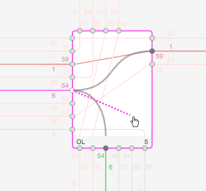

## Connections

Connections can be easily created by following these steps:

- Select the train for which you want to create a connection.
- Instead of re-routing the trainrun, you can use the pin (circle) to connect the trainrun to another
  trainrun. To create the connection, drag and drop the pin where the trainrun is aligned to node
  to another trainrun pin in the same node.

  > When dragging within a node, the line will appear dashed, and small circles will indicate all
  > possible connections (pins).

- Drag the line to the desired circle using drag and drop, and the connection will be drawn.

### Create connections

[2024-1-25_DrawConnections.webm](https://github.com/SchweizerischeBundesbahnen/netzgrafik-editor-frontend/assets/2674075/d5a8837c-187b-4fc8-876a-91ca58085828)

### Delete connections

To delete a connection, simply release the pin holding the connection outside of the node.

[2024-1-25_DeleteConnections-001.webm](https://github.com/SchweizerischeBundesbahnen/netzgrafik-editor-frontend/assets/2674075/e6b9ff56-d4c3-4c0b-9cf4-56fe5fa249df)

### Delete connections with the help of Perlenkette

By using the Perlenkette (pearl chain), connections can be easily deleted. In the Perlenkette, you
can see all the connections for a selected train. To delete a connection, follow these steps:

- In the Perlenkette, locate the connections for the selected train that you want to delete.
- Click on the connections to mark them. (Clicking again removes the marking.)
- Once the connections are marked, press `Delete` to delete all the marked
  connections.

[2024-1-25_DeleteConnections_Perlenkette_select_delete-002.webm](https://github.com/SchweizerischeBundesbahnen/netzgrafik-editor-frontend/assets/2674075/7307f446-fc05-41c3-8c1c-a18d04a7dea2)
