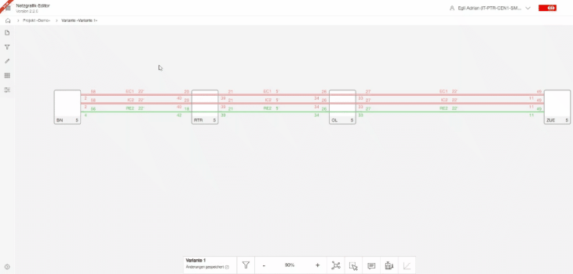

## Filters

In the network Netzgrafik-Editor, the "What You See Is What You Get" principle applies.
This means that everything you have displayed will be drawn, analyzed, and can be edited.
Therefore, the filtering function plays a crucial role. It offers a wide range of possibilities,
from simple filtering to very complex and user-specific settings, allowing you to create complex
views.

In the Netzgrafik-Editor, the "What You See Is What You Get" principle applies. This means that
everything you have displayed will be drawn, analyzed, and can be edited. Therefore, the filtering
function plays a crucial role. It offers a wide range of possibilities, from simple filtering to
very complex and user-specific settings, allowing you to create complex views. This allows for
complex editing and analysis.

### Simple Filtering

o open the filter, click either on the filter symbol in the sidebar on the left or at the bottom
center of the same filter symbol. This will open the filter sidebar on the left side. Here, you can
adjust the filter settings. Any changes made to the filter will immediately affect the network map
or graphical timetable (route graph). When filters are active, the filter symbol will be highlighted
in red.

If you want to temporarily reset the filtering, click again on the filter symbol at the bottom of
the menu bar. The filter symbol will display an "x," indicating that the filtering is temporarily
disabled. Clicking again will reactivate the filter.

To completely reset the filter, click on "Reset Filter" in the filter sidebar.

To filter trains based on the criteria of train category, frequency, peak-hour service, and off-peak
service, you can proceed as follows:

- Train category filtering: Determine the desired train category, such as regional trains, intercity
  trains, or freight trains. Filter the trains according to this category to display only the
  desired trains.

- Frequency filtering: If you want to view trains with a specific frequency, specify it. For
  example, you can search for trains that run every half hour, hourly, or every two hours.

- Service during specific periods: Filter the trains according to specific times, such as peak
  hours, off-peak hours, or irregular service. This allows you to display trains that operate only
  during specific time periods.

### Filterable labels

Users can add user-defined labels to trains, notes, and nodes.
These labels, also known as filterable labels, can be used to create custom filters based on
user-specific criteria.

Filterable labels can be grouped and sorted, making it easy to create new filter groups.
Within a filter group, such as train category or frequency, complex filters can be quickly created.

To do this, you need to switch to the editing tool and navigate to the filterable labels,
specifically the filterable nodes if you want to edit nodes. In the filterable nodes section,
labels can be sorted within a group using drag and drop. The sorting will be saved.

Additionally, a new group can be created by using the "+" button,
and a group can be deleted using the "-" button. Filter labels in the deleted group
will automatically be moved back to the default group after deletion.

When clicking on a label (button), a dialog window opens with three functions: rename, delete, and
apply the label globally or to all nodes, trains, or notes.

- Rename: Allows you to change the name of the label.
- Delete: Removes the label. If applied globally, it will be removed from all nodes, trains, or
  notes.
- Apply globally: Transfers the label to all nodes, trains, or notes. This means that the label will
  be added to all existing and future nodes, trains, or notes.

These functions provide flexibility in managing and customizing labels according to your needs.

### Filtering trainrun with filterable labels

### Modifiy filterable labels

### Filtering Nodes with filterable labels

### Filer text (display)

