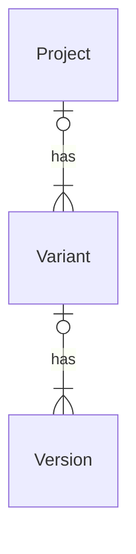

## Project/Variant

The user can define nodes, train runs, along with their routes and attributes to create a
comprehensive Netzgrafik. The Netzgrafik undergoes multiple changes during
editing. Each time it is modified, a new temporary version is created. Once the user publishes the
latest version, all intermediate versions are removed, and the new version is permanently stored.

If the user wants different variants to study, he can duplicate any version to create a new
independently editable variant within the project. When working on different projects, it is
recommended that the user creates a separate project for each project. This allows for separate
management of associated variants to each project.

### Create a new Project

To create a new project, simply click on the "+" symbol and enter a name, an abstract, and a short
description. Now you have created a first project that can contain multiple variants.

[29-01-2024-001-Create_new_project.webm](https://github.com/SchweizerischeBundesbahnen/netzgrafik-editor-frontend/assets/2674075/4e34d3a2-5291-4193-ac88-5e522f6223f7)

#### Share a project

Users can share their projects with other employees and assign different access rights. There are two options:

- write access
- read access.

#### With write access,

... the employee with whom the project is shared can edit the project, make changes to it, or delete it, including creating, deleting, and archiving variants.

#### With read access,

... the employee can only view and read the project, but cannot make any changes to it (cannot save).

The choice between write access and read access depends on the desired level of collaboration and contribution from the employees to the project.

#### Example

### Create a new Variant within a project

To create a new variant of a project, simply click on the "+" symbol and enter a name. As soon as
you have
created a new variant in the project, the editor will open automatically.

[29-01-2024-002-create_new_variant.webm](https://github.com/SchweizerischeBundesbahnen/netzgrafik-editor-frontend/assets/2674075/1af2c5f5-84cf-43b1-bf3d-85c0ef692ff0)

### Become creative (start editing)

#### Clear template Netzgrafik

The editor opens the newly created Netzgrafik. The new Netzgrafik contains some initially created
nodes from which users can draw trainruns with their sections. In most projects these nodes are not
required. If so, press `ctrl`+`a` to select all elements of the current Netzgrafik and press `delete`
to remove them.

[29-01-2024-003-clear_variant_data.webm](https://github.com/SchweizerischeBundesbahnen/netzgrafik-editor-frontend/assets/2674075/47c7a9e5-5c4a-4159-a7fa-141347dae264)

#### Create/import nodes

For more details have a look into [create and modifiy nodes](CREATE_NODES.md).

#### Create trainruns

For more details have a look into [create and modifiy trainrun](CREATE_TRAINRUN.md).

## Basic Concept: Project / Variants

### Data Model

The data model for the basic concept of Project/Variants includes the following entities:

- **Project:** This entity represents a project. It contains information such as the project name,
  project description, and other project-related data, such as users identifiers with read
  or write access.

- **Variant:** This entity represents a variant within a project. It contains information such as
  the variant name and description.

- **Version:** This entity represents a version within a variant. Versions are used to store the
  change history and preserve intermediate changes during the creative process. They allow users to
  restore any previous version if needed.

The relationship between the entities is as follows:

A user has to publish a version of a variant when he is ready with editing/creating the variant.
Only publish version becomes visible to all other users with access rights. Until the version is
published, the full version history remains available.

> When a user publishes a version, the intermediate versions between the last published version and
> the new published version are removed.

### User roles and access right

> This information is specific to the internal context of SBB and may need to be adapted for other
> organizations.

Read and write access to projects and underlying variants is restricted to a certain group of
people.
For this purpose, the table "projects_users" maintains a list of users (identified by their user id)
for each project. Only the listed users have access to the project. Users with the "is_editor" flag
have write access to the project. Users without the flag have read access by default.
Any user with the "User" role is allowed to create a new project. The creator of a project is
automatically granted write access to the project.

Users with the "Admin" role have access to all projects regardless of the "projects_users" table.

### Concept and comprehensible example

Every Netzgrafik project requires one or more variant studies. The following graphic illustrates the
conceptual structure of project and variant management in the Netzgrafik-Editor:

Conceptual structure of project and variant management - example

This implemented concept makes it possible to manage several planning projects. Several variants can
be created for each planning project. Different versions can be created separately for each variant
that corresponds to a Netzgrafik.

Based on a main version, several different users can create their own snapshot versions in parallel.
However, only one user at a time can create a new main version.

All other user changes that are made later lead to an editing conflict. All editing conflicts must
be resolved manually. An editing conflict can be resolved with the following three options:

- By overwriting the previously published version (active enforcement required)
- By creating a new variant (branch)
- By deleting the changes by accepting the published version.

Step-by-step example

| Version | Snapshot version | Author |                                              Comments                                              |
| :-----: | :--------------: | :----: | :------------------------------------------------------------------------------------------------: |
|    -    |        1         |  u123  |       Initial empty network diagram that is automatically created when creating the variant.       |
|    -    |        2         |  u123  |                                  First modification by user u123.                                  |
|    -    |        3         |  u123  |                                 Second modification by user u123.                                  |
|    -    |        4         |  u123  |                                                ...                                                 |
|    -    |        5         |  u123  |                                                ...                                                 |
|    1    |        6         |  u123  |   Main version "1" has been published by user u123. Other users can now see the network diagram.   |
|    1    |        1         |  u123  |                     User u123 makes further changes based on main version "1".                     |
|    1    |        2         |  u123  |                                                ...                                                 |
|    1    |        1         |  u456  |                User u456 also opens main version "1" in parallel and makes changes.                |
|    1    |        2         |  u456  |                                                ...                                                 |
|    1    |        3         |  u456  |                                                ...                                                 |
|    1    |        2         |  u456  |      User u456 is the first to publish the new main version "2" based on their modifications.      |
|    2    |        3         |  u123  | User u123 also wants to publish their modifications as main version "2" **=> editing conflicts !** |
|         |                  |        |              Alternatively, user u123 can save their modifications as a new variant.               |

#### Flow chart

### Delete a project / variant

Deletion is primarily enabled through the following detour. The variants within a project can be
archived and will only appear if explicitly requested to display them. The same applies to projects.
Projects and variants can only be deleted from the archive. Therefore, no variant or project can
be deleted directly. It must always be moved to the archive first. From the archive, the variant or
project can be deleted or restored, i.e., the archiving can be undone. This logic is intended to
prevent projects or variants from being accidentally deleted.

> If a project is deleted, all of its variants will also be deleted.

### Visibility of versions

It is important to understand that the projects and variants are available to all users with read
or write access. The snapshot versions are only visible to the respective editing user and are no
longer available to the user after publication (saving) since they are automatically deleted after
successful publishing.
