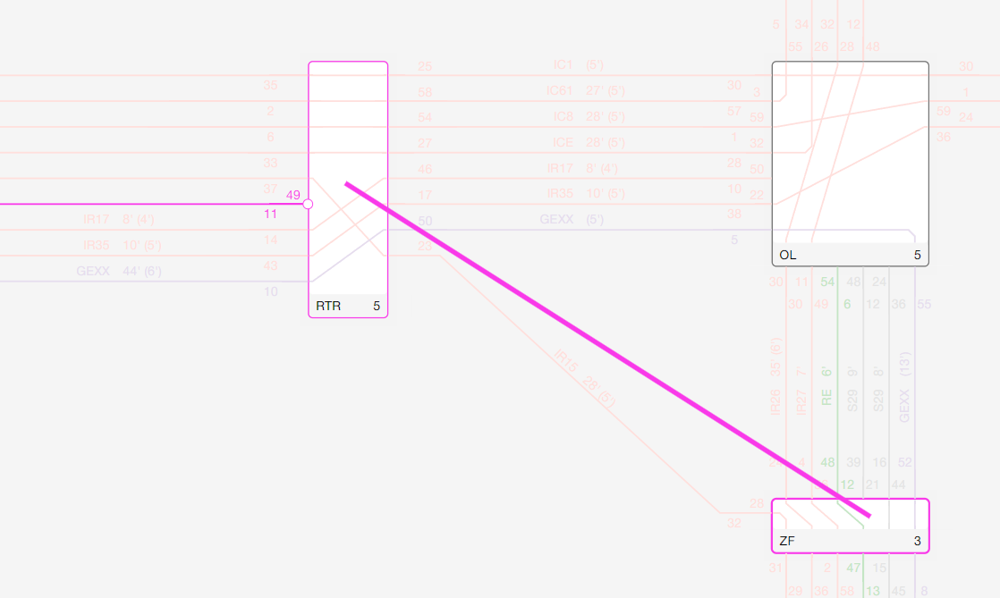
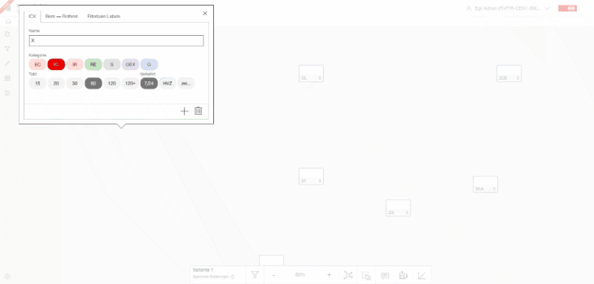
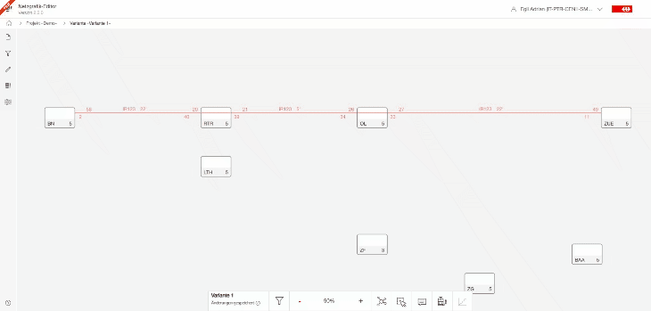
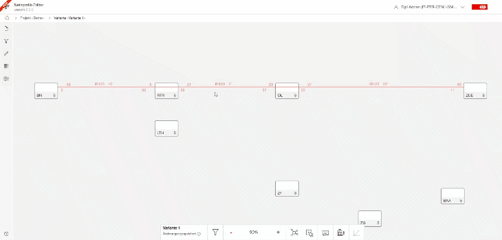

## Trainruns

### Create new trainrun

With the help of the left mouse button and keyboard you can create or modify any trainrun.

- If no trainrun is selected - you can create a new trainrun just by graphical drawing.
- If a trainrun is selected you can modify a trainrun, including extending the trainrun traveling
  path (route), reroute the path, delete a trainrun or just a trainrun section. Further you can
  change the times such as departure time, arrival time, traveling time or you can further modify
  the trainrun category and name.

When a new trainrun gets created the system opens a dialog window where you can enter all
information about the new created trainrun, such a trainrun category and name. Then click outside
the window or press 'ESC' to close the dialog window.

> - If you like to (re)open the dialog windows just click on the trainrun name in the editor or
    click any number (time). The dialog windwo is displayed again with the clicked data input field
    in focus.
> - If you click on the trainrun - its gets selected and you can modify it.
> - Click for a second time the Perlenkette gets opened.

For mor details have a look into [create and modifiy trainrun](CREATE_TRAINRUN.md).

#### Create new trainrun section - step by step

To create a new train or adding new trainrun section to an existing trainrun, proceed as follows:

- Move with the mouse pointer to the (inner) node: Press the left mouse button on the inner node
  from which you want to start the trainrun section.
- Hold down the left mouse button and drag the line to the other node. The line display visually the
  trainrun section you want to create.
- Configure the train route: Give the new train an appropriate name and specify the necessary
  details, such as train number or other relevant information.

> **Note:** Importantly, you don't have to select a train route to create a new trainrun -
> otherwise, you modify the selected trainrun

### Rerouting trainrun sections

To reroute a train, follow these steps:

- Select the train to be rerouted: Use the left mouse button and click to select the train that you
  want to reroute.
- Drag and drop sections on the node: After selecting the train, you can rearrange sections of the
  train by dragging and dropping the small pins on the nodes. This allows you to reassign sections
  to other nodes.
- Redirect train sections: If you want to redirect (reroute) two sections, you can easily do so by
  clicking and holding the left mouse button on the hexagon button on the node. Then, drag and drop
  the hexagon button, and both train sections will move together. Drag the sections to a different
  node to reroute them.
  > If you drag the hexagon button outside the node it generates an intermediat stop if there was a
  stopping transition or it just removed the non-stop transition. For both cases it reroutes the
  trainrun.

#### Delete a trainrun section

To delete a trainrun section, process as follows:

- Click the trainrun to modify (select the trainrun)
- Move with the mouse pointer to one of the two pins (cricle) where the trainrun section is aligned
  to the node
- Press left mouse button and drag the pin (trainrun section). Instead of reassign to another or
  same node, just release it outside the node

### Toggle stop / non-stop at node (trainrun transition)

To switch a train from a stop to a non-stop at a node, follow these steps:

- Select the train: Ensure that the train you want to modify is selected. You can do this by
  left-clicking on the train.
- Access train transitions: Locate the hexagon button within the node representation. This button
  signifies train transitions (Stop/Non-Stop).

 

