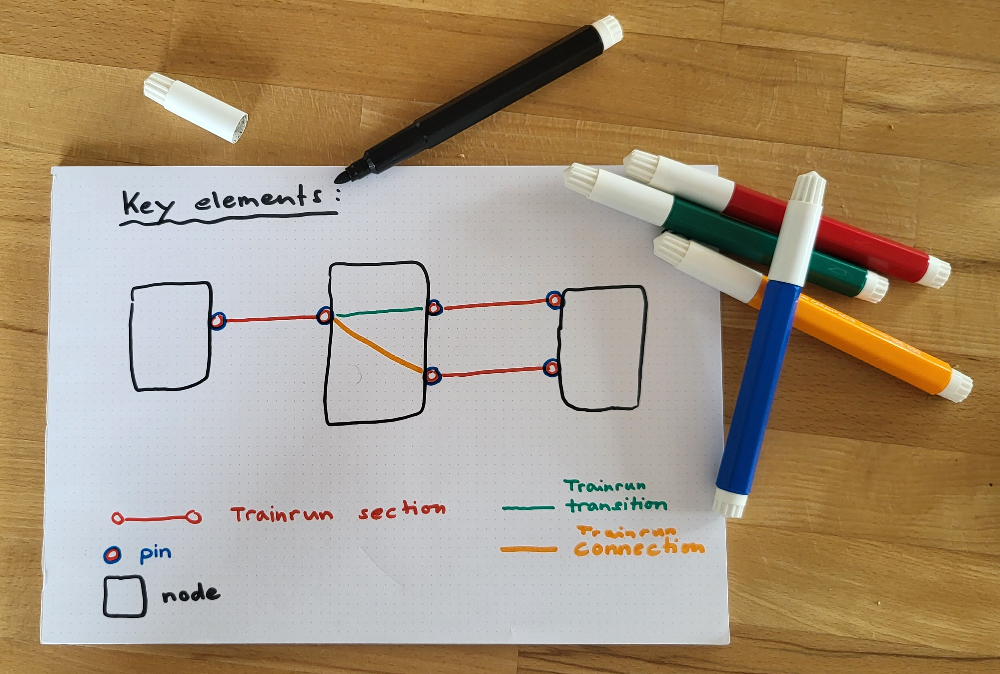
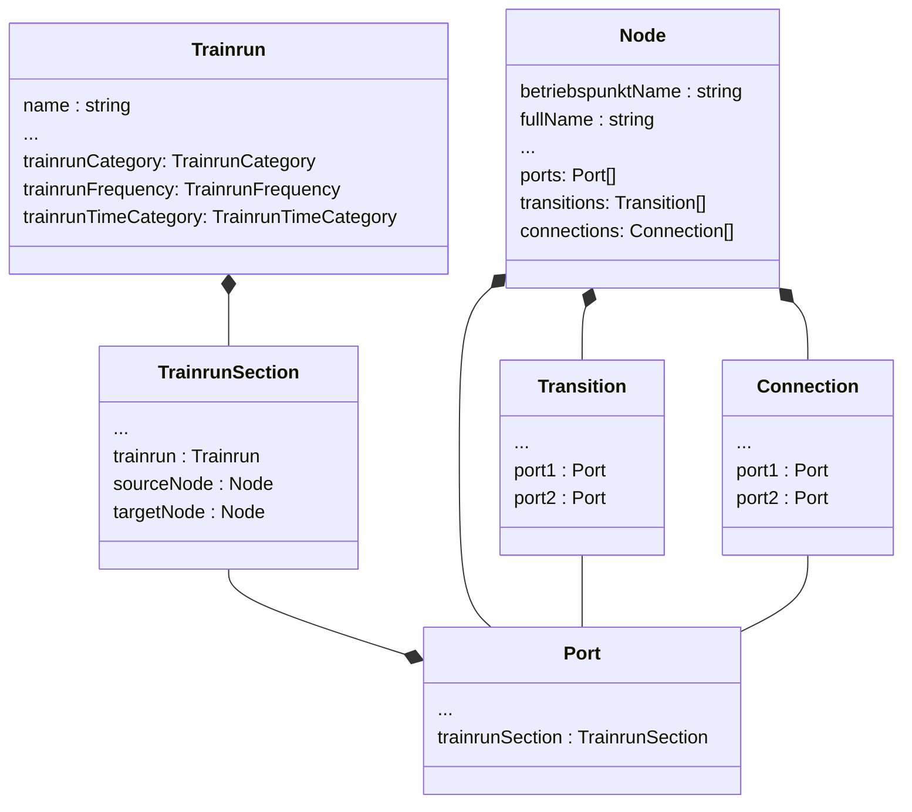
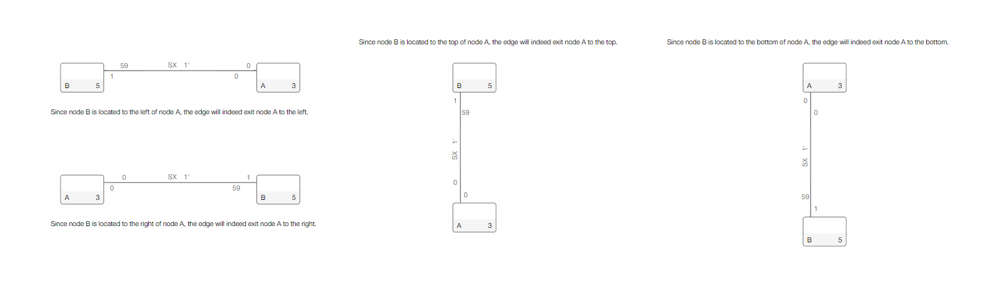
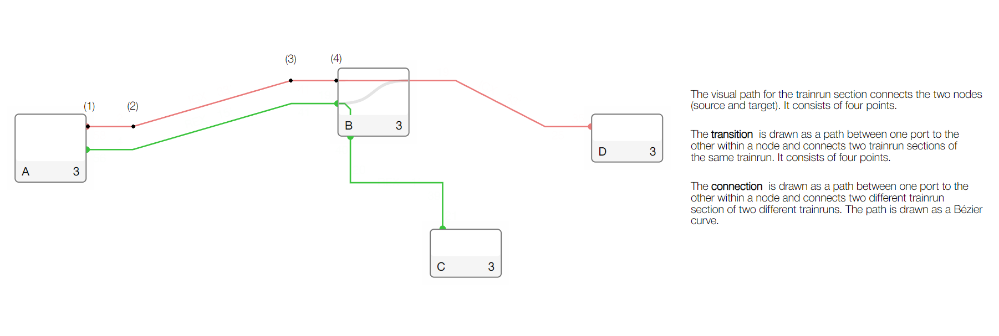

## Data model

The data model consists of the following key elements: **_trainrun_**, **_trainrun section_**,
**_transition_**, **_trainrun connection_**, **_port_** and **_node_**.



---

### Business orientated description

The nodes in the data model represent the specific locations, such as stations or stops, where a
trainrun can have different actions or events associated with it. These nodes serve as key points in
the trainrun's route, determining where it stops, passes through, or starts and ends.

On the other hand, the trainrun section represents a specific segment or portion of a trainrun that
connects two nodes. It encapsulates all the relevant information related to that particular section,
including temporal details like departure and arrival times. Additionally, it also stores the
journey time, which indicates the duration it takes for the trainrun to move from one node to
another.

The trainrun connection signifies the point in the logistic network where two trains need to
coordinated to ensure a smooth connection between them.

In addition, a trainrun has references to behaviour-related abstractions such as
category, frequency and time category, which define the behaviour of a trainrun.

- **_Category_** specifies the type of trainrun, e.g. a regional train, an intercity train or a
  goods train.
- **_Frequency_** defines the frequency with which the trainrun is carried out, e.g. 1/4h, 1/2h
  or every hour.
- **_TimeCategory_** defines the time categorisation of the trainrun, e.g. peak times or
  off-peak times or occasional.
- **_Direction_** defines the direction of the trainrun (`round_trip` or `one_way`).

By combining the nodes and trainrun sections in this data model, we can create a representation of
the trainrun network, mapping out the connections and relationships between the different stations
and the time it takes to traverse between them. This enables us to analyze and visualize complex
trainrun routes and schedules.

---

### Technically orientated description


Thus, the data model, consisting of TrainrunSection and nodes, forms a network of edges and nodes,
similar to an undirected graph. The TrainrunSections represent the connections between the nodes and
enable the representation and analysis of complex relationships in the model.

- **_TrainrunSection_** corresponds to the edges between nodes in an undirected graph.
- **_Nodes_** represent the points in the graph, allowing the connection of trainrun section .
- A _pin_ represents a **_port_** (point) in the graph where a trainrun section is connected to a
  node.
- The **_transition_** extends the graph within the node. A transition corresponds to an edge that
  connects two pins within the node, thereby connecting two trainrun section.
- If two trainruns should make a connection at a station, this can be defined using a
  **_connection_**. The trainrun connection links two pins, each have to be associated with a
  different train.

Together, these elements form an undirected graph consisting of edges (TrainrunSections,
Transitions) and nodes (Ports).

The last key element is the **_trainrun_**. The trainrun consists of an ordered sequence of
trainrun sections and transitions. This ordered sequence defines the route of the trainrun and
establishes a direction in the undirected graph. This direction corresponds to the exact path of the
train.



##### Data structure

More specific information about the business and technical data can be referenced in the data
[structure definitions](https://github.com/SchweizerischeBundesbahnen/netzgrafik-editor-frontend/tree/main/src/app/data-structures)
within the source code.

##### Ports alignment

The key concept of network visualization is to obtain a clear and automated representation of
connections (lines). For this purpose, a routing heuristic is implemented, which arranges the lines
in a visually organized manner.



To begin with, the heuristic focuses on the pair of nodes that are connected by the trainrun
section. At each node, a decision is made regarding whether the line exits the node in an
upward-downward direction or a left-right direction. This decision is based on the following logic:
If the other node is positioned above, the edge will exit upwards; otherwise, it will exit
downwards. If the other node is located to the right of the current node, the edge will exit the
node to the right; conversely, if it is located to the left, the edge will exit to the left. The
prioritization is given to the upward-downward direction over the left-right direction.

By implementing this routing heuristic, the network visualization achieves an organized
representation of the lines, ensuring clarity and ease of understanding.

```typescript
export enum PortAlignment {
  Top, // 0
  Bottom, // 1
  Left, // 2
  Right, // 3
}
```

See for more
details [VisAVisPortPlacement.placePortsOnSourceAndTargetNode(srcNode, targetNode)](./../src/app/services/util/node.port.placement.ts).

##### Ports sorting

The sorting heuristics description can be found in
the [chapter](./CREATE_NODES.md#MultipleTrainruns), it is
worth taking a look there before diving into the source
code [Node.sortPorts()](<./../src/app/models/node.model.ts#:~:text=sortPorts()%20{>) for detailed information.

##### Pre-computed paths

Trainrun sections, connections, and transition all have the path to be drawn stored (pre-defined).
This storage makes it very easy for the rendering to determine whether the path has
changed or not. Once the path changes, it is redrawn. Therefore, as long as there are no changes,
nothing is rendered, which greatly increases the interactivity of the application but also requires
more storage space.



Additionally, using the native JSON format adds more complexity because the stored path must be
provided during import.

More details can be found in the source code:

- [Node.computeTransitionRouting()](./../src/app/models/node.model.ts#:~:text=computeTransitionRouting)
- [Node.computeConnectionRouting()](./../src/app/models/node.model.ts#:~:text=computeConnectionRouting)
- [TrainrunSection.routeEdgeAndPlaceText()](<./../src/app/models/trainrunsection.model.ts#:~:text=routeEdgeAndPlaceText()%20{>)
- [TrainrunSectionService.initializeTrainrunSectionRouting()](<./../src/app/services/data/trainrunsection.service.ts#:~:text=initializeTrainrunSectionRouting()%20{>)

---

### Iterate through all train run sections (forward/backward)

To understand how the trainrun iteration has to work, please take another look at this illustration:


#### General

The [TrainrunIterator](https://github.com/SchweizerischeBundesbahnen/netzgrafik-editor-frontend/blob/d170955ecc466bfa9c10071927c63199eb7a86f7/src/app/services/util/trainrun.iterator.ts#L12) operates over a structure that can be conceptualized as an undirected acyclic graph (DAG), where each trainrun is a connected component.

##### Structure

- **TrainrunSection:** Each section has a source and a target node, analogous to an edge in a graph. The trainrun section is not directly connected to a node. It's connected via a port.
- **Node:** Nodes manage connections through ports, ports are effectively acting as a vertex within the graph.
- **Transition:** Transitions connect two train sections within a node with the help of ports. They can be interpreted as edges in the graph.

##### Traversal

To initiate traversal, it is important to specify a location (node) where the traversal begins. To determine the traversal direction a trainrun section is required. The trainrun section must be connected to the node. Otherwise the traversal will fail. With the help of the trainrun section the traversal method determines the travel direction. Therefore, a tuple consisting of a node and a trainrun section is needed for each traversal. This tuple determines the directed edge in the directed graph. Each edge in a directed graph points to another node. For example, if the given node is the source node, the iterator moves towards the target node; if the node is the target node, the iterator moves towards the source node. This can be defined very simply using the tuple.

Upon reaching a node, the transition is the object that determines the transition from the input port to the output port within the node. This is important to correctly determine the transition from the incoming trainrun section to the continuing trainrun section. Therefore, to continue traversing through the next section, a transition is needed. Once no transitions are available, the traversal stops. At that point, either the target node of the trainrun or, conversely, the starting node is found.

The TrainrunIterator can effectively traverse through the trainrun sections by utilizing the source and target nodes of each section. This approach eliminates the need to explicitly maintain a direction in the data and is independent of the input (drawing direction). This allows everything to be kept very simple for the user.

#### TrainrunIterator

The TrainrunIterator is a concept aimed at iterating through the sections of a trainrun, similar to how one navigates through the edges of a graph. Here is a detailed description of how this iterator works and how it can be used:

##### Structure of the Trainrun

- **Graph**: The entire graph is generally an undirected acyclic graph (DAG). Each trainrun (segment) represents a connected component.

##### Traversal Logic

- **Starting Point**: Iteration begins with a given node and a specific trainrun section.
- **Section Connection**: The iterator moves through connected sections by utilizing the source and target nodes of each section.
- **Transitions**: When a transition is reached, the next connected section is followed through the corresponding port.
- **End of Traversal**: Iteration ends when no further sections or transitions are available.

##### Example Application

- **Initialization**: The iterator is initialized with a start node ID and a specific trainrun section.
- **Forward Traversal**: The iterator moves from section to section by navigating from one node to the next. During traversal, the source and target nodes of the sections are used to determine the path.
- **Backward Traversal**: To traverse in the opposite direction, the iterator can be re-initialized with the end node ID of the current traversal and the corresponding trainrun section. This reverses the path and allows a return to the starting point.

##### Detailed Steps

1. **Start with a Node ID and a Trainrun Section**: The iterator begins with a defined node ID and a specific trainrun section. This represents the starting point.
2. **Section-wise Traversal**: The iterator traverses the sections by using the connections between the nodes. It moves from the source node to the target node of a section.
3. **Handling Transitions**: When a transition within a node is reached, the iterator follows the transition to the next connected section.
4. **Traversal End**: Iteration ends when no further connected sections or transitions are available. This signals the end of the trainrun.

The TrainrunIterator enables structured traversal through the sections of a trainrun by using both a node ID and a specific trainrun section as a starting point. This increases the precision and flexibility of the traversal. By utilizing the source and target nodes of each section and following transitions within the nodes, the iterator can efficiently navigate through the entire trainrun. This method is particularly useful for traversing complex trainrun paths and ensuring that the traversal logic is correctly understood and applied both forwards and backwards.

If functionality should be initiated by providing a port ID, this could be a further extension allowing a start directly from a specific port. However, this functionality is not yet implemented.

---

### Links

[Netzgrafik-Editor data export/import (JSON)](DATA_MODEL_JSON.md)
