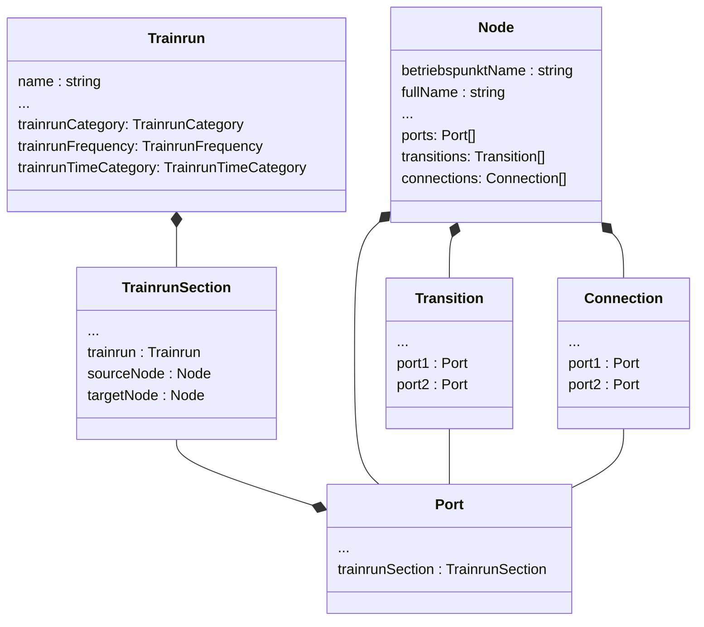

## Data model

The data model consists of the following key elements: ***trainrun***, ***trainrun section***,
***transition***, ***trainrun connection***, ***port*** and ***node***.


### Business orientated description

The nodes in the data model represent the specific locations, such as stations or stops, where a
trainrun can have different actions or events associated with it. These nodes serve as key points in
the trainrun's route, determining where it stops, passes through, or starts and ends.

On the other hand, the trainrun section represents a specific segment or portion of a trainrun that
connects two nodes. It encapsulates all the relevant information related to that particular section,
including temporal details like departure and arrival times. Additionally, it also stores the
journey time, which indicates the duration it takes for the trainrun to move from one node to
another.

The trainrun connection signifies the point in the logistic network where two trains need to
coordinated to ensure a smooth connection between them.

In addition, a trainrun has references to behaviour-related abstractions such as
category, frequency and time category, which define the behaviour of a trainrun.

- ***Category*** specifies the type of trainrun, e.g. a regional train, an intercity train or a
  goods train.
- ***Frequency*** defines the frequency with which the trainrun is carried out, e.g. 1/4h, 1/2h
  or every hour.
- ***TimeCategory*** defines the time categorisation of the trainrun, e.g. peak times or
  off-peak times or occasional.

By combining the nodes and trainrun sections in this data model, we can create a representation of
the trainrun network, mapping out the connections and relationships between the different stations
and the time it takes to traverse between them. This enables us to analyze and visualize complex
trainrun routes and schedules.

### Technically orientated description

Thus, the data model, consisting of TrainrunSection and nodes, forms a network of edges and nodes,
similar to an undirected graph. The TrainrunSections represent the connections between the nodes and
enable the representation and analysis of complex relationships in the model.

- ***TrainrunSection*** corresponds to the edges between nodes in an undirected graph.
- ***Nodes*** represent the points in the graph, allowing the connection of trainrun section .
- A *pin* represents a ***port*** (point) in the graph where a trainrun section is connected to a
  node.
- The ***transition*** extends the graph within the node. A transition corresponds to an edge that
  connects two pins within the node, thereby connecting two trainrun section.
- If two trainruns should make a connection at a station, this can be defined using a
  ***connection***. The trainrun connection links two pins, each have to be associated with a
  different train.

Together, these elements form an undirected graph consisting of edges (TrainrunSections,
Transitions) and nodes (Ports).

The last key element is the ***trainrun***. The trainrun consists of an ordered sequence of
trainrun sections and transitions. This ordered sequence defines the route of the trainrun and
establishes a direction in the undirected graph. This direction corresponds to the exact path of the
train.



##### Ports alignment

The key concept of network visualization is to obtain a clear and automated representation of
connections (lines). For this purpose, a routing heuristic is implemented, which arranges the lines
in a visually organized manner.


To begin with, the heuristic focuses on the pair of nodes that are connected by the trainrun
section. At each node, a decision is made regarding whether the line exits the node in an
upward-downward direction or a left-right direction. This decision is based on the following logic:
If the other node is positioned above, the edge will exit upwards; otherwise, it will exit
downwards. If the other node is located to the right of the current node, the edge will exit the
node to the right; conversely, if it is located to the left, the edge will exit to the left. The
prioritization is given to the upward-downward direction over the left-right direction.

By implementing this routing heuristic, the network visualization achieves an organized
representation of the lines, ensuring clarity and ease of understanding.

```typescript
export enum PortAlignment {

    Top, // 0

    Bottom, // 1

    Left, // 2

    Right // 3

}
```

See for more
details [VisAVisPortPlacement.placePortsOnSourceAndTargetNode(srcNode, targetNode)](./../src/app/services/util/node.port.placement.ts#placePortsOnSourceAndTargetNode).

##### Ports sorting

The sorting heuristics can be found in the [chapter](./CREATE_NODES.md#MultipleTrainruns), it is
worth taking a look there before diving into the source
code [Node.sortPorts()](./../src/app/models/node.model.ts#sortPorts) for detailed information.
 
