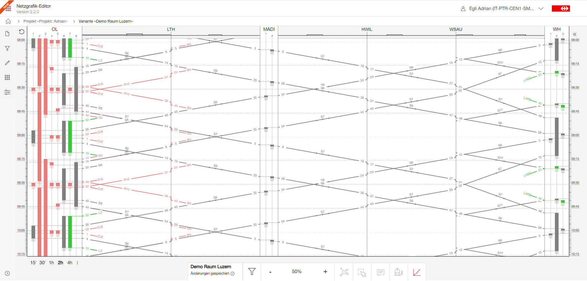

## Graphic timetable (Streckengrafik)

### Show graphic timetable (Streckengrafik)

To generate the graphic timetable user must follow this steps:

- To display the graphical timetable, a train must be selected. The selected trainrun defines the
  corridor along which the graphical representation will be created. Thus select a train and then
  click on the "Graphical Timetable" icon in the menu bar at the bottom.
- The graphical timetable view will open.

#### Explanation

The graphic timetable (Streckengraphik) is a ***distance-time diagram***. This diagram is a
representation which shows the relationship between the distance travelled and the time taken. The
diagram shows the course of train journeys along a route corridor.

In the distance-time diagram, the horizontal axis (x-axis) represents the distance traveled a long
the corridor of interest, and the vertical axis (y-axis) represents time. The units on the time axis
are given in minutes. Due to the unspecified distance in the previously designed Netzgrafik, the
exact distance cannot be determined. To ensure readability, there are two different scaling
heuristics:

- **Equal distances between the sections**: Each section has the same width, i.e. it has the same
  number
  of pixels. It is important to understand that the speed can only be compared within a section
  based on the angles. Comparing two sections based on the angle is not very meaningful as the
  actual distance travelled can be very different. Therefore, the comparison cannot be made due to
  the lack of information.

- **Assuming a constant speed for the selected train along the entire corridor**: This means that
  trains travelling faster than the reference train will have a lower gradient, while trains
  travelling slower will have a steeper gradient (more on this later). This scaling makes it
  possible to compare the speed (difference) of any other trainrun to the selected train on the
  entire corridor.

The distance-time diagram provides a graphical overview of the entire route and reveals points of
intersection between trains. These intersection points can provide information about potential
conflicts or temporal overlaps between different trainruns. The diagram is a useful tool for
analyzing route progress and timetables, identifying potential conflicts, and developing alternative
solutions to ensure smooth train operations.

### Built-in analytics

#### Track occupier

When clicking on a node, a details view opens and shows the track occupancy. The track occupancy is
calculated using a heuristic approach, allowing us to estimate and visualize the minimum number of
tracks (platforms) required at the node.

With this calculation, each train occupies a track during its dwell time and continues to occupy it
for n minutes afterwards. This post-occupancy time is typically closely linked to the
infrastructure (e.g. train headway time). A usual headway time is 2 minutes.

Considering the trainrun dwell time allows for estimating the minimum number of tracks required at a
node. This provides a rapid and clear indication of whether the node has sufficient capacity or if
there must be future expand the node's capacity to run the concept smoothly.

This information can help in efficient train planning and ensures that there is adequate
infrastructure to accommodate trains during their scheduled stops. It enables better utilization of
resources and facilitates smooth and reliable train processes. Further can this information help to
continue working on a variant or reject in a early phase.

When a train ends or starts at a node, track occupancy is more complicated. The track occupancy must
take the turnaround into account. A simple turnaround is possible if the minimum dwell time for the
turnaround is not too short. A common time is set to four minute. (But the exact time can be defined
for each trainrun category). If the minimum turnaround time is not reached, another rolling stock
must be used and the other one must wait until the next departure. This ends in an additional track.
This additional requirement is implemented for each trainrun start and end nodes. This makes the
track occupier more realistic, but also more complex.

#### Minimum number of tracks on sections

The distance-time diagram provides a graphical overview of the entire corridor of interest and
reveal points of intersection or overlap between different train runs. These intersection points
indicate potential conflicts or temporal overlaps between trains. The temporal overlaps takes also
into account of the headway time which can be defined for each trainrun category seperatly.

By analyzing these conflicting regions in the distance-time diagram, it is possible to estimate the
minimum number of tracks needed to ensure smooth train operations. These projections can give
valuable insights into infrastructure requirements and might help plan for the optimal number of
tracks at specific sections along the route.

By considering the potential conflicts or overlaps in the distance-time diagram, infrastructure
capacity can be properly assessed, and appropriate measures can be taken to address any bottlenecks
or constraints. Again, this information can be helpful in deciding early on whether to continue
working on the variant or reject it.