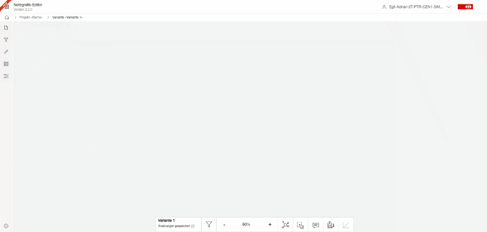

# Netzgrafik-Editor User Documentation

#### Table Of Contents

- [Introduction](#Introduction)
- [New Project/Variant](#CreateNewProjectVariant)
- [BasicFunctions](#BasicFunctions)
- [Nodes](#Nodes)
- [Trainruns](#Trainruns)
- [Connections](#Connections)
- [Graphic timetable (Streckengrafik)](#Streckengrafik)
- [Pearls view (Perlenkette)](#Perlenkette)
- [Filter](#Filter)
- [Conclusion](#Conclusion)

## Introduction

This document provides an overview of its key features and instructions on how to interact with
the editor effectively.

Key Features

1. **Network Creation:**
   The Netzgrafik-Editor enables users to create network graphics from scratch.
   Users can define nodes, trainruns and attributes to build a comprehensive Netzgrafik
   representation.

2. **Node and Trainrun Customization:**
   Users can customize nodes, trainrun with its sections and connections in the network graphics.
   This includes changing the appearance (trainrun category, frequency), labeling, and adding
   additional information such as connections.

3. **Drag-and-Drop Interface:**
   The editor offers a user-friendly drag-and-drop interface, allowing users to easily position
   nodes
   which impacts directly visual the routing of the edges (trainruns) and transitions and
   connections
   within the node. This intuitive feature simplifies the creation and adjustment of network layout.

4. **Advanced Editing:**
   Users can perform advanced editing operations such as copy (Ctrl+C), paste (Ctrl+V),
   duplicate (Ctrl+D), delete (Del) and undo (Ctrl+Z) in multiple steps - either using the
   standard Ctrl+z key command or with help of the version history. These editing features make
   management easier to process complex network structures efficiently. User don't need to
   explicitly save the latest changes. The system save it automatically.

5. **Collaboration and Sharing:**
   The Netzgrafik-Editor provides collaboration features, enabling multiple users to work on the  
   same network graphic simultaneously. Users can share their work with others, track changes,
   and collaborate seamlessly.

---

## New Project/Variant

### Create a new Variant within an Project

To create a new variant of a project, simply click on the "+" symbol and enter a name. You have already created a new variant in the project.

--- 

## BasicFunctions

### Duplicate trainrun
To duplicate a train in the project, follow these steps:

- Select the train: Use the left mouse click to select the train that you want to duplicate.
- Duplicate the train: Once the train is selected, press "Ctrl + D" on your keyboard to duplicate it. This action will create an identical copy of the selected train.
- Edit the train name: Click on the train name with the left mouse button, and a dialog window will open, allowing you to edit the train's details. Make the necessary changes to the train name or any other relevant information.
> **Optional:** Edit the train in the pearls view: If you click on the selected train again, the pearls view will open on the right side. At the top, there is an option to edit the train similarly to the dialog window. Use this option to make any additional edits to the train.

### Copy all visible elements

### Insert copied elements

### Delete all visible elements

---

## Nodes

### Move nodes and clean up drawing

## Trainruns

### Create new trainrun

To create a new train route, proceed as follows:

- Select the inner node: Click the left mouse button on the inner node from which you want to start
  the trainrun section.
- Connect the node: Hold down the left mouse button and drag the connecting line to the other node
  that you want to connect the train section to.
- Configure the train route: Give the new train an appropriate name and specify the necessary
  details, such as train number or other relevant information.

> **Note:** Importantly, you don't have to select a train route - otherwise, just edit the selected
> train route instead of creating a new one.

### Rerouting trainrun sections
To reroute a train, follow these steps:
- Select the train to be rerouted: Use the left mouse click to select the train that you want to reroute.
- Drag and drop sections on the node: After selecting the train, you can rearrange sections of the train by dragging and dropping the small pins on the nodes. This allows you to reassign sections to different parts of the train's route.
- Redirect train sections: If you want to redirect (reroute) two sections, you can easily do so by clicking and holding the left mouse button on the hexagon button on the node. Then, drag and drop the hexagon button, and both train sections will move together. Drag the sections to a different node to reroute them.

### Toggle stop / non-stop at node (trainrun transition)
To switch a train from a stop to a non-stop at a node, follow these steps:

- Select the train: Ensure that the train you want to modify is selected. You can do this by left-clicking on the train.
- Access train transitions: Locate the hexagon button within the node representation. This button signifies train transitions (Stop/Non-Stop).

## Show graphic timetable (Streckengrafik)
To display the graphical timetable, a train must be selected. It defines the corridor along which the graphical representation will be created. 
This corridor is shown on the horizinal axes of the chart. The time is displayed on the other axis.
To do this, first select a train and then click on the "Graphical Timetable" icon in the menu bar at the bottom. 
The graphical timetable view will open, displaying the train's route and timeline.

---

## Pearls view (Perlenkette)

The pearls view allows you to view and edit the entire trainrun from a vertical perspective. It is displayed on the right-hand side.
In the upper part of the pearls view, the train information is displayed. 
It can also be expanded to get more information. It also allows to edit the train name, category or frequency. 

Between the title and the train route display, there is a sorted list of all the passed nodes. 
These nodes are displayed as buttons, which enable quick synchronization with the Netzgrafik.
If you click on a node button, the viewpoint (center) will automatically be readjusted. 
Similarly, clicking on a train section will center that section in the Netzgrafik, allowing for easy navigation and visualization.

### Show perlenkette
To access it, select a train first. Then, by clicking on the train again, the pearls view will open on the right side, 
displaying the train's route as a vertical chain of nodes and trainrunsections.

---

## Connections
Connections can be easily created by following these steps:

- Select the train for which you want to create a connection. 

Instead of re-routing the train, you can use a pin where the trainrun is connected to a node.
To create the connection, drag and drop the pin from one node to another.

When dragging within a node, the line will appear dashed, and small circles will indicate all possible connections.
Drag the line to the desired circle using drag and drop, and the connection will be drawn.

### Create connections

### Delete connections
If you want to delete a connection, simply release the pin outside a node.

### Delete connections with the help of pearls view
By using the pearls view, connections can be easily deleted. In the pearls view, you can see all the connections 
for a selected train. To delete a connection, follow these steps:

- In the pearls view, locate the connections for the selected train which should be deleted.
- Click on the connections to mark them. (Clicking again removes the marking.)

Once the connections are marked, press the "Delete" key (DEL) to delete all the marked connections.

 |

---

## Filter
In the network Netzgrafik-Editor, the "What You See Is What You Get" principle applies. 
This means that everything you have displayed will be drawn, analyzed, and can be edited. 
Therefore, the filtering function plays a crucial role. It offers a wide range of possibilities,
from simple filtering to very complex and user-specific settings, allowing you to create complex views.

### Simple Filtering

### Filtering with the help of trainrun filterable labels

### Modifiy filterable labels

### Filtering Node filterable labels

### Filtering Nodes

### Filer text (display)

### Filer text (display)

---

## Conclusion

By following the instructions in this document, users can effectively create and facilitate the
creation of comprehensive and visually appealing network representations.