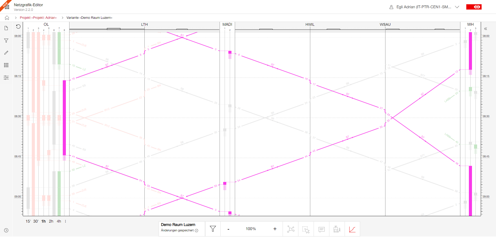

# Netzgrafik-Editor User Documentation

## Table Of Contents

- **General**
  - [Introduction](#Introduction)
  - [Project/Variant](#CreateNewProjectVariant)
- **Creating/editing Netzgrafik**
  - [Nodes](#Nodes)
  - [Trainruns](#Trainruns)
  - [Connections](#Connections)
  - [Split/Combine two trainruns](https://github.com/SchweizerischeBundesbahnen/netzgrafik-editor-frontend/blob/main/documentation/Split_Combine_Trainruns.md)
  - [Merge Netzgrafik](https://github.com/SchweizerischeBundesbahnen/netzgrafik-editor-frontend/blob/main/documentation/Merge_Netzgrafik.md)
- **Show/hide information**
  - [Filters](#Filter)
- **Views**
  - [Graphic timetable (Streckengrafik)](#Streckengrafik)
  - [Perlenkette](#Perlenkette)
- **Advanced User Interaction**
  - [Advanced editing short-cuts](https://github.com/SchweizerischeBundesbahnen/netzgrafik-editor-frontend/blob/main/documentation/AdvancedEditingShortcuts.md)
- [Links](#Links)

Additional information can be found under the provided [links](#Links).

## Introduction

This document provides an overview of its key features and instructions on how to interact with
the editor effectively.

Key Features

1. **Interactive Drawing Interface:** The user can define nodes, trains with their routes and
   attributes to create a comprehensive Netzgrafik. The editor offers a user-friendly
   drag-and-drop interface that allows to easily draw the entire Netzgrafik. When a node
   is repositioned (moved), the edge paths of all train segments at the node are redrawn using a
   heuristic to minimize the number of overlapping edges. This ensures that the network graph is
   always clear and easy to read. Additionally, connections between trains can be drawn using
   drag-and-drop. This intuitive feature simplifies the creation and customization of the network
   layout.

2. **Graphic timetable (Streckengrafik):**
   All lines (trainruns) defined in the Netzgrafik can be transferred into a graphical timetable
   representation (Streckengrafik). In addition to displaying the timetable graphically,
   this graphical timetable provides a new track occupancy estimation at the nodes and between the
   nodes (lines). It estimates the required minimum infrastructure, such as the number of tracks.
   This enhances the capability for clear and quick analytics directly through the graphical
   timetable.

3. **Advanced Analytics:**
   Increasing demands are being placed on advanced analytical abilities. Analyzing journey routes
   through the logistics network is crucial. A first version has been implemented that allows users
   to analyze the logistics network based on the timetable representation. It provides insights into
   connection coordination, transfer times and journey times.

4. **Collaboration and Sharing:**
   The Netzgrafik-Editor provides collaboration features, enabling multiple users to work on
   the same Netzgrafik simultaneously. Users can share their work with others, track changes,
   and collaborate seamlessly. Exporting and sharing the designed Netzgrafik is also a useful
   function that improves further processing with third parties.

---

## Project/Variant

The container in which the planning work takes place is a project. Projects have a name and can be described. User authorisations for writing and reading are assigned at project level. Variants can be created within the projects, each of which contains a Netzgrafik (network graphic). Variants can be compared within a project.
For more details and to create your first Netzgrafik have a look into [create a new project](CREATE_PROJECT.md).

<!---

### Copy all visible elements

[2024-1-25-SelectAll_ctrl-a-and-copy-ctrl-c.webm](https://github.com/SchweizerischeBundesbahnen/netzgrafik-editor-frontend/assets/2674075/9d39523b-4770-4494-9aaa-092780451db7)

### Insert copied elements

[2024-1-25-CtrlV-Insert_copied.webm](https://github.com/SchweizerischeBundesbahnen/netzgrafik-editor-frontend/assets/2674075/5c3cd5ff-d505-4f59-bd31-2f12ed62818c)

### Delete all visible elements

[2024-1-25-SelectAll-ctrl_a-delete.webm](https://github.com/SchweizerischeBundesbahnen/netzgrafik-editor-frontend/assets/2674075/87c9ee98-98ce-4a20-961a-b878a62aec67)
--->

---

## Nodes

The nodes represent the specific locations, such as stations or stops, where a trainrun can have different actions or events associated with it. These nodes serve as key points in the trainrun's route, determining where it stops, passes through, or starts and ends ([see data model](DATA_MODEL.md)).

For more details have a look into [create and modify nodes](CREATE_NODES.md).

## Trainruns

A trainrun consists of one or more trainrun sections. The trainrun section represents a specific segment or portion of a trainrun that connects two nodes. It encapsulates all the relevant information related to that particular section, including temporal details like departure and arrival times. Additionally, it also stores the journey time, which indicates the duration it takes for the train to run to move from one node to another.

A trainrun has references to behaviour-related abstractions such as
category (e.g., a regional train, an intercity train or a goods train), frequency (e.g., 1/4h, 1/2h or every hour), and time category (e.g., peak times or off-peak times or occasional), which define the behaviour of a trainrun ([see data model](DATA_MODEL.md)).

For more details have a look into [create and modify trainrun](CREATE_TRAINRUN.md).

- [Split / Combine two trainruns](https://github.com/SchweizerischeBundesbahnen/netzgrafik-editor-frontend/blob/main/documentation/CREATE_TRAINRUN.md#split--combine-two-trainruns)
- [Merge two independent Netzgrafik](https://github.com/SchweizerischeBundesbahnen/netzgrafik-editor-frontend/blob/main/documentation/CREATE_TRAINRUN.md#merge-two-indepandant-netzgrafik)

## Connections

For more details have a look into [create and modify connections](CREATE_CONNECTIONS.md).

---

## Filters

For more details have a look into [create and modify filters](CREATE_FILTERS.md).

---

## Graphic timetable (Streckengrafik)

For more details have a look into [graphic timetable](Graphic_Timetable.md).

---

## Perlenkette

The Perlenkette allows you to view and edit the entire trainrun from a vertical perspective. It is
displayed on the right-hand side.
In the upper part of the Perlenkette, the train information is displayed.
It can also be expanded to get more information. It also allows you to edit the train name, category or
frequency.

Between the title and the train route display, there is a sorted list of all the passed nodes.
These nodes are displayed as buttons, which enable quick synchronization with the Netzgrafik.
If you click on a node button, the viewpoint (center) will automatically be readjusted.
Similarly, clicking on a train section will center that section in the Netzgrafik, allowing for easy
navigation and visualization.

### Show Perlenkette

To access it, select a train first. Then, by clicking on the train again, the Perlenkette will open
on the right side,
displaying the train's route as a vertical chain of nodes and trainrunsections.

[2024-1-25_DeleteConnections-Perlenkette-Show_Connections.webm](https://github.com/SchweizerischeBundesbahnen/netzgrafik-editor-frontend/assets/2674075/d272fc58-3f31-4427-aacf-cc3c50c03905)

### Change the time locks

The time can be locked so that no propagation (automated update) will be done. Just click on the lock icon and the lock state switches: On to off or vice-versa.

### Toggle: show all locks / or only closed (default)

In the Perlenkette view, you can click on the eye icon in the bottom left corner
to display all locks. By default, only the locks that are closed are shown. This is
visually visible with the disabled eye icon. When you click on the icon then the disabled
eye icon switches to the visible eye icon - or vice-versa. Visible eye means all locks are visible.

---

## Conclusion

By following the instructions in this document, users can effectively create and facilitate the
creation of comprehensive and visually appealing network representations.

---

## Links

- [Netzgrafik-Editor data export/import (JSON)](DATA_MODEL_JSON.md)
- [DATA MODEL](DATA_MODEL.md)

## Technical documentation

- [Trainrun iterator](https://github.com/SchweizerischeBundesbahnen/netzgrafik-editor-frontend/blob/main/documentation/technical/trainrun_iterations.md)
